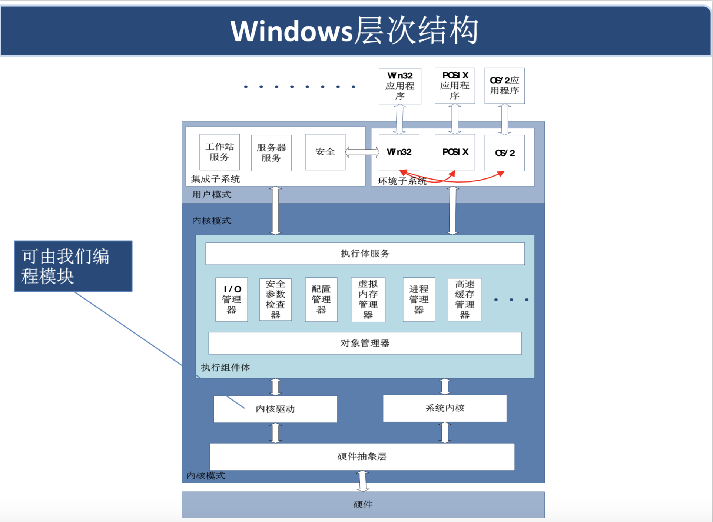
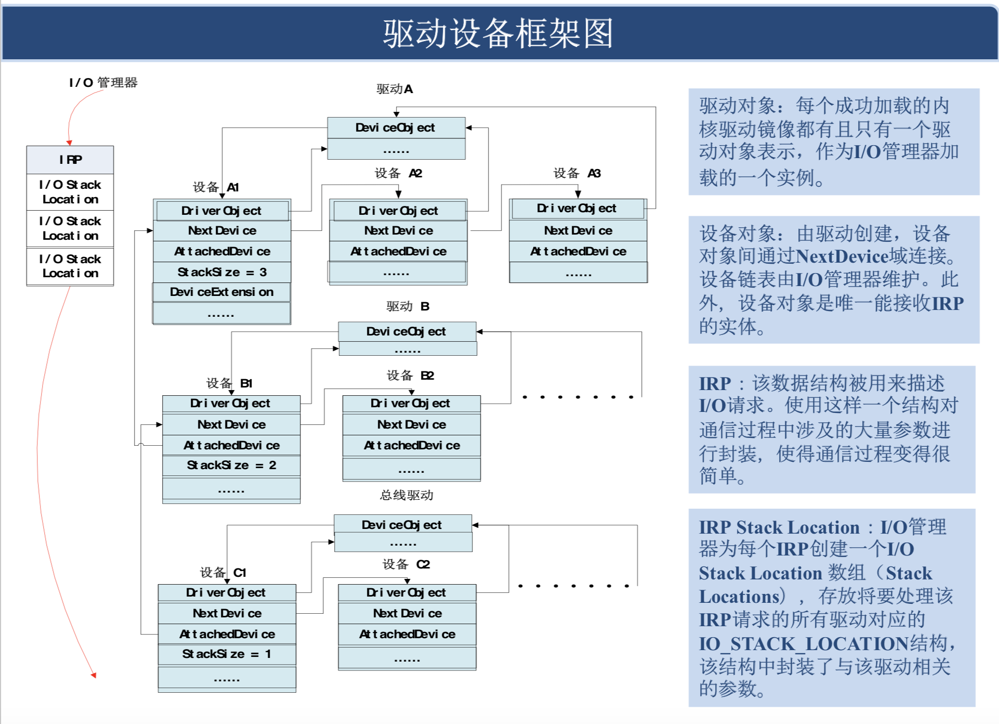
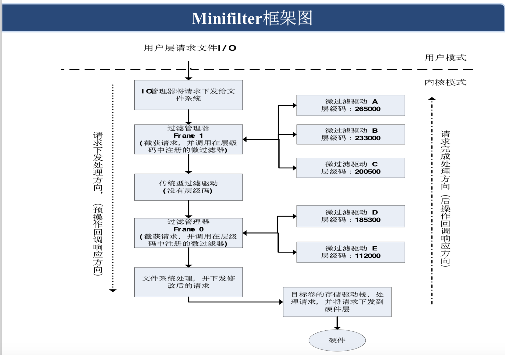
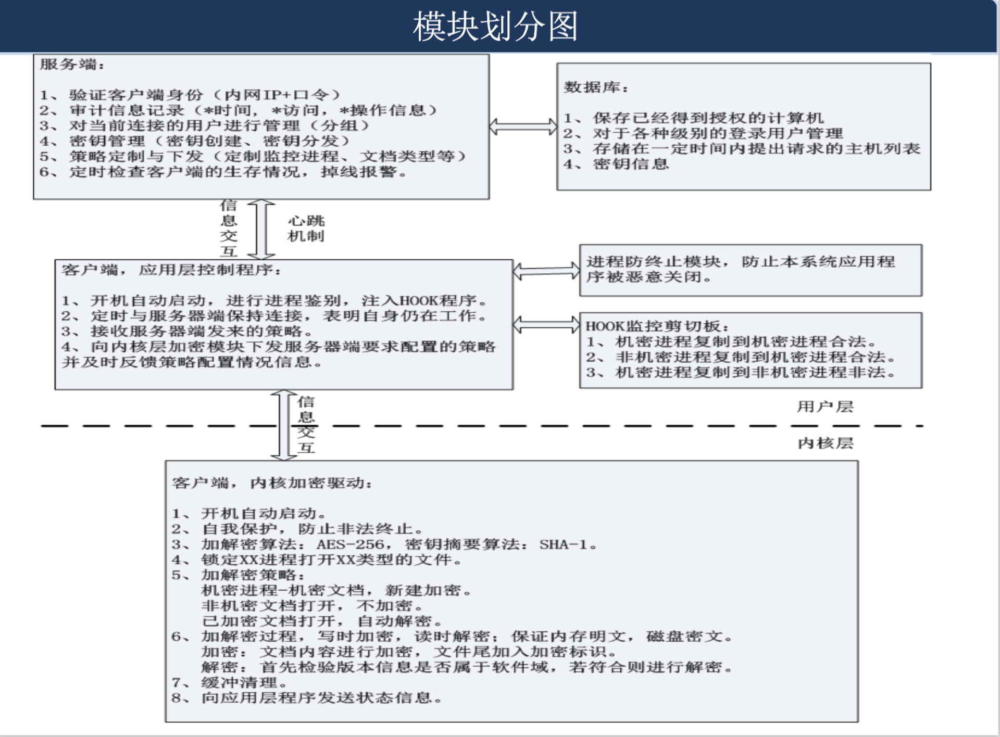
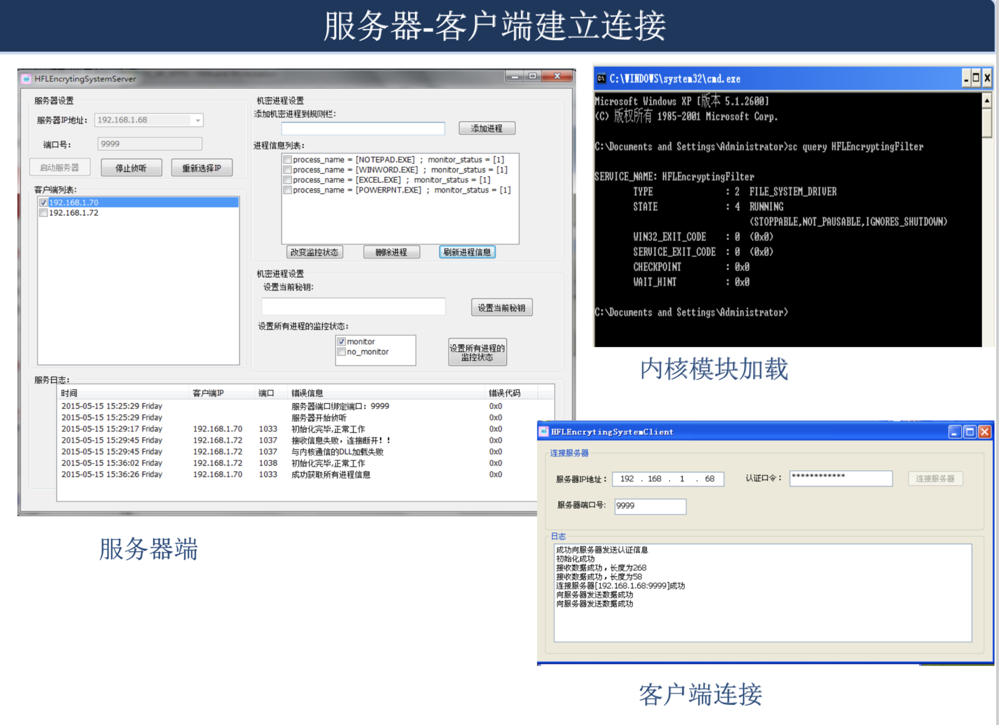
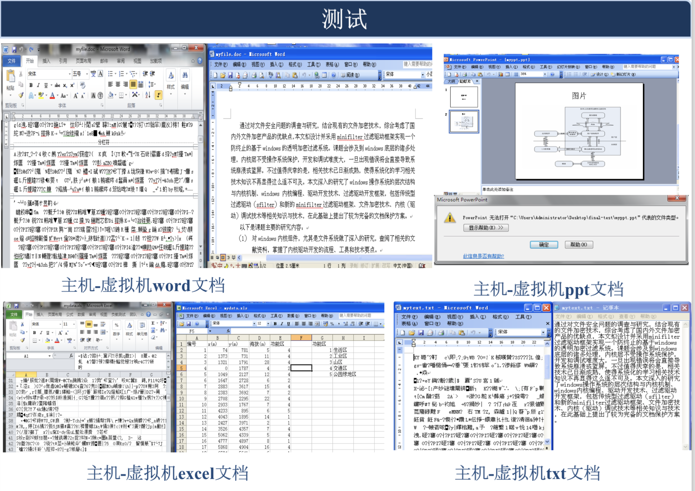
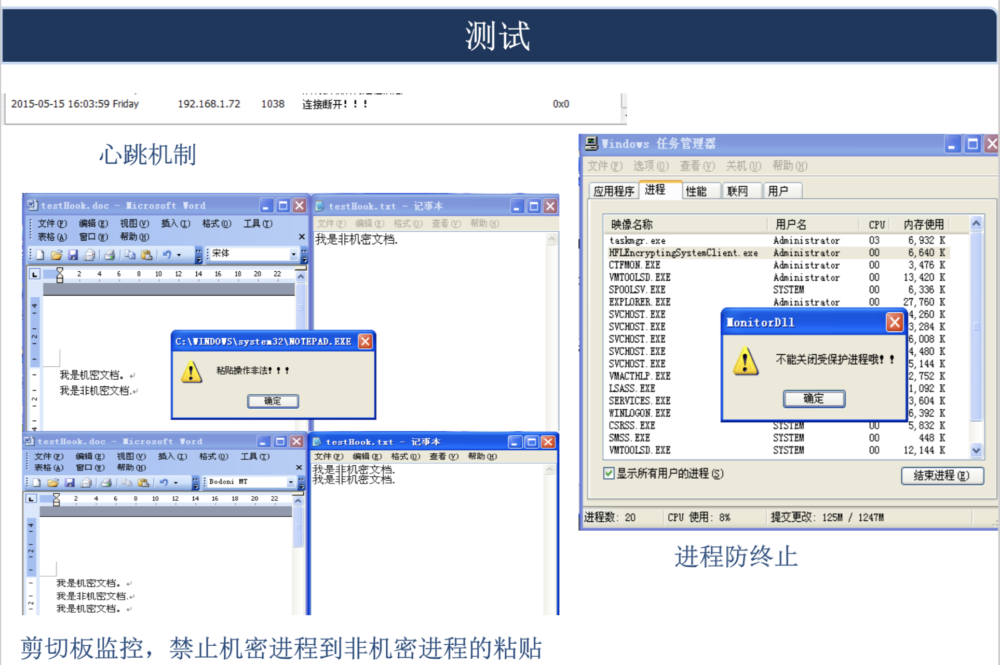

# windows kernel development

- [x] demo\_source\_code
- [x] graduation\_thesis
- [x] TechnicalWorkshop-windows\_kernel\_programing

**keywork: hook api, windows kernel, file system, minifilter, driver**

# windows kernel and file system

# my undergraduate thesis

